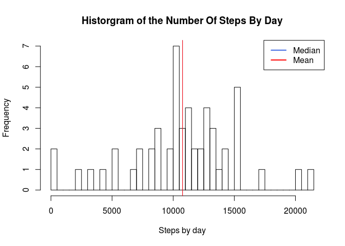
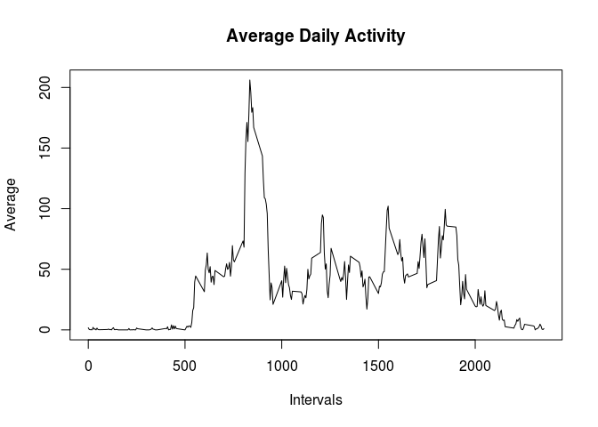
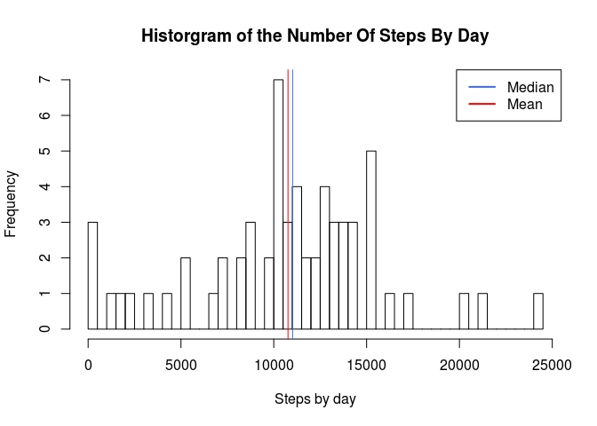
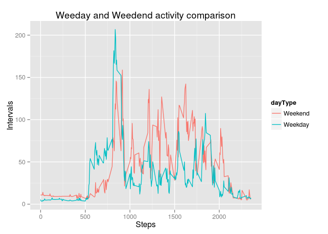

# Reproducible Research: Peer Assessment 1


## Loading and preprocessing the data

Loading required libray


```r
library(dplyr)
```

```
## 
## Attaching package: 'dplyr'
## 
## The following object is masked from 'package:stats':
## 
##     filter
## 
## The following objects are masked from 'package:base':
## 
##     intersect, setdiff, setequal, union
```

```r
library(ggplot2)
```

Unzip and load extracted file to the variable `activityData`.


```r
dataFile = 'activity.csv'
zipFile = 'activity.zip'
if (!file.exists(dataFile)){
  unzip(zipfile = zipFile, exdir = '.')  
}
activityData = read.csv(file = dataFile, stringsAsFactors = F)
```

Convert the field `activityData$date` to a date format


```r
  activityData$date = as.POSIXct(activityData$date, '%Y-%m-%d')
```

Split the original dataset in two, the first one wihtout NA values and the other with just the NA values


```r
  activityDataNoNA = activityData[!is.na(activityData$steps),]
  activityDataNA = activityData[is.na(activityData$steps),]
```

## What is mean total number of steps taken per day?

Group and summarize data by date


```r
  stepsByDay = select(activityDataNoNA, date, steps) %>% 
    group_by(date) %>% 
    summarize(sum(steps))
```


```r
  hist(stepsByDay$'sum(steps)', breaks = 40, main = 'Historgram of the Number Of Steps By Day', xlab = 'Steps by day')

  medianOfSteps = median(stepsByDay$'sum(steps)')
  meanOfSteps = mean(stepsByDay$'sum(steps)')

  abline(v = medianOfSteps, col = "royalblue", lwd = 1)
  abline(v = meanOfSteps, col = "red", lwd = 1)

  legend(x = "topright", c("Median", "Mean"), col = c("royalblue", "red"), lwd = c(2, 2, 2))
```

 

* Median of steps: 10765
* Mean of steps: 10766.19

## What is the average daily activity pattern?

```r
avgDailyActivity = select(activityDataNoNA, interval, steps) %>% group_by(interval) %>% summarise(mean(steps))

plot(x = avgDailyActivity$interval, y = avgDailyActivity$'mean(steps)', type = 'l', main = 'Average Daily Activity', xlab = 'Intervals', ylab = 'Average')
```

 


## Imputing missing values

This is the number of NA by day


```r
  naValuesByDay = select(activityDataNA, date, steps) %>% 
      group_by(date) %>% 
      tally()
  naValuesByDay
```

```
## Source: local data frame [8 x 2]
## 
##         date   n
## 1 2012-10-01 288
## 2 2012-10-08 288
## 3 2012-11-01 288
## 4 2012-11-04 288
## 5 2012-11-09 288
## 6 2012-11-10 288
## 7 2012-11-14 288
## 8 2012-11-30 288
```

For imputing missing values it is going to make use of the `avgDailyActivity` dataset to fill NA values that match with the `interval` field.


```r
activityDataNA$steps = merge(activityDataNA, avgDailyActivity, by='interval')$'mean(steps)'
#bind vertically 
activityDataImputed = rbind(activityDataNoNA, activityDataNA)
activityDataImputed = arrange(activityDataImputed, date, interval)
```

Group and summarize data by date


```r
  stepsByDay = select(activityDataImputed, date, steps) %>% 
    group_by(date) %>% 
    summarize(sum(steps))
```


```r
  hist(stepsByDay$'sum(steps)', breaks = 40, main = 'Historgram of the Number Of Steps By Day', xlab = 'Steps by day')

  medianOfSteps = median(stepsByDay$'sum(steps)')
  meanOfSteps = mean(stepsByDay$'sum(steps)')

  abline(v = medianOfSteps, col = "royalblue", lwd = 1)
  abline(v = meanOfSteps, col = "red", lwd = 1)

  legend(x = "topright", c("Median", "Mean"), col = c("royalblue", "red"), lwd = c(2, 2, 2))
```

 

* Median of steps: 11015.00
* Mean of steps: 10766.19

## Are there differences in activity patterns between weekdays and weekends?


```r
  # genereate boolean array. True is weekday and false is weekend
  weekday = as.POSIXlt(activityDataImputed$date)$wday %in% 1:5
  # transform into int
  weekdayInt = as.integer(weekday)
  # create factory variable, 0 is weekend and 1 weekday. 
  activityDataImputed$dayType = factor(weekdayInt, levels=c(0,1), labels = c('Weekend', 'Weekday'))
  #plot
  avgDailyActivity = select(activityDataImputed, interval, steps, dayType) %>%  group_by(dayType, interval) %>% summarise(meanSteps = mean(steps))

  g = qplot(
    interval, 
    meanSteps, 
    data = avgDailyActivity, 
    geom='line' , 
    xlab = 'Steps', 
    ylab = 'Intervals', 
    group = dayType,
    shape=dayType, color=dayType,
    main = 'Weeday and Weedend activity comparison'
  )
  print(g)
```

 

